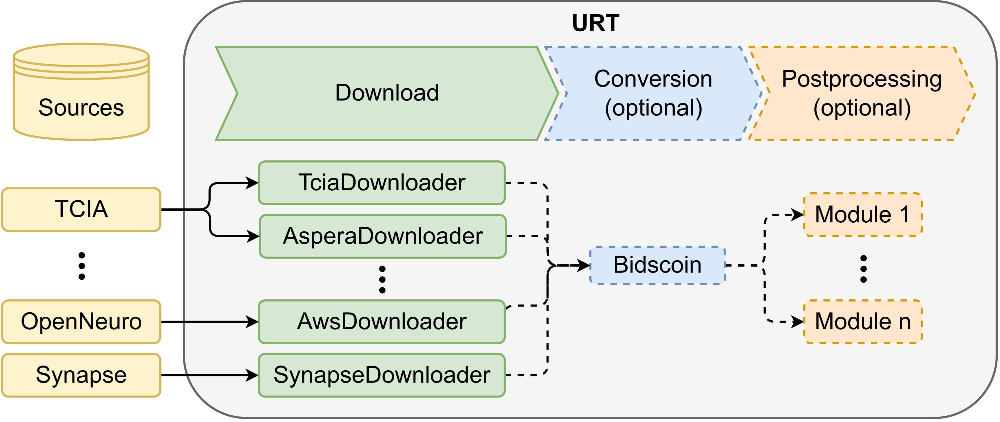

# Unified Retrieval Tool (URT)
URT is a tool for automatically downloading datasets from diverse sources and converting them to the standardized BIDS format. It supports seamless downloads of whole dataset collections with one simple command. 

Currently it supports Synapse, TCIA and OpenNeuro as sources but the tool is build with modularity and extensibility in mind, thus it is easy to integrate new sources. Adding new datasets for from already implemented sources is easy and only requires some metadata about the format and source of the dataset. For a subset of all downloadable datasets a conversion mapping exists for the automatic download and conversion to the BIDS format by using the Bidscoin library. The collection of automatically convertible datasets is expected to grow in the future to relief researchers from the manual labor involved in this process. 

 All built-in downloaders emphasize fault tolerance and data integrity.


## Table of Contents

- [Unified Retrieval Tool (URT)](#unified-retrieval-tool-urt)
  - [Table of Contents](#table-of-contents)
- [Prerequisites](#prerequisites)
  - [Basic](#basic)
  - [Docker](#docker)
  - [Singularity](#singularity)
- [Usage](#usage)
  - [Arguments](#arguments)
  - [Basic](#basic-1)
  - [Docker](#docker-1)
    - [Docker compose](#docker-compose)
  - [Singularity](#singularity-1)
- [Supported Datasets](#supported-datasets)
- [Accessing restricted datasets](#accessing-restricted-datasets)
- [Architecture Details](#architecture-details)
  - [Adding Datasets](#adding-datasets)
    - [Only for download](#only-for-download)
    - [For automatic BIDS conversion](#for-automatic-bids-conversion)
  - [Adding Downloaders](#adding-downloaders)
  - [Adding Modules](#adding-modules)
- [Changelog](#changelog)
  - [\[2.0.0\] - 2024.02.29](#200---20240229)
    - [Added](#added)
    - [Changed](#changed)
    - [Removed](#removed)

# Prerequisites
**It is strongly suggested to use URT with docker or singularity to avoid dependency conflicts.** This also reduces the amount of prerequisites. Nevertheless the tool can be used without container software as well.

## Basic
For the basic usage it is highly recommended to use conda or mamba for managing the environment. The tool officially supports Linux, but other distributions like MacOS or Windows (with WSL) might work as well. 

- Conda or Mamba
- OPTIONAL: aws cli (required for downloads from OpenNeuro)
- OPTIONAL: aspera-cli (required for downloads from TCIA which are stored as NIFTI)

First download the URT repo
```bash
git clone https://github.com/LuxImagingAI/URT.git
```
and navigate to the URT directory:
```bash
cd URT
```
The environment.yaml file can be used to automatically set up an evironment with all the required dependencies, this avoids dependency conflicts. Use 
```bash
conda env create -f environment.yaml
```
to create the environment and activate it via:

```bash
conda activate URT
```

The environment contains all required dependencies for downloading datasets from Synapse, DICOM datasets from TCIA and the bids conversion. If datasets from OpenNeuro or NiFTI datasets from TCIA are required then the optional dependencies need to be installed as well. Unfortunately it is not possible to include them in the conda environment. Docker/singularity is the preferred way if you want to avoid installing these dependencies.
## Docker
Docker version 4.24 or newer

## Singularity
Singularity version 3.8.1 or newer


# Usage
## Arguments

`--collection`: 
The name of the collection which should be downloaded. 

Alternatively a .yaml file containing a list of collections for batch-processing of multiple datasets. An example can be seen in "config/collections.yaml".

A list of type "[COLLECTION_1, COLLECTION_2, ...]" can be given as well.

`--output_dir`:
The output directory for the data. 

Default: "./output"

`--temp_dir`:
The directory where the data is stored temporarily, i.e. during the download (before compression). Can be useful in situations where not much space is left on the output drive. 

Default: "./temp"

`--cache_dir`:
Directory which is used for the output of the logs and the http cache. 

Default: "~/.cache/tcia_downloader"

`--credentials`:
Path to credentials.yaml file containing the credentials. The credentials file is only needed in cases where datasets with limited access are downloaded.

Default: "config/credentials.yaml"

`--bids`:
If this argument is given the dataset(s) will be converted to bids after the download (if the required data for the conversion is given in datasets).

Default: False

`--compression`:
If this argument is added the output folder will be automatically compressed.

Default: False

## Basic
The following command will start URT with the given arguments.
```bash
python downloader.py --dataset DATASET [--output_dir OUTPUT_DIR] [--temp_dir TEMP_DIR] [--cache_dir CACHE_DIR] [--credentials CREDENTIALS_FILE] [--bids] [--compress]
```
URT will choose the appropriate downloader for the given collection (based on datasets/datasets.yaml). If the collection cannot be found it will fall back to downloading via the nbia REST API (TCIA) and attempt a download of the collection. BIDS conversion is not possible in this case.

If datasets from OpenNeuro or TCIA via Aspera are downloaded make sure that the additional dependencies are installed.

## Docker
> **Warning:** As long as the project is not published yet the docker image is only available through a private repo on dockerhub. Before running the image you need to login to dockerhub by executing: 
> ```bash
> docker login --username raphaelmaser@gmail.com
>```
> with the password "dckr_pat_2H7B0b4fIYPndw4hl1vXFr72KHs"

By using docker you can avoid the installation of any dependencies and achieve higher reproducibility.

The container can be started by executing:
```Bash
docker run -v ./output:/URT/output -v ./temp:/URT/temp -v ./cache:/URT/cache [-v ./config:/URT/config] ydkq4eu2vrqc2uuy8x3c/URT:dev --dataset DATASET [--bids] [--compress]
```
In the case of docker the output directory, temporary directory and cache directory can be changed by modifying the mounted volumes in the docker run command. E.g. replacing "./output:/downloader/output" by "~/output:/downloader/output" will move the output folder to the home directory.

### Docker compose
> **Warning:** The same restrictions concerning the private repo apply here.

The usage of docker compose is supported as well. Start docker compose by executing:
```Bash
docker compose up
```
The arguments and volumes can be changed in the compose.yaml file.

## Singularity
> **Warning:** As long as the project is not published yet the docker image is only available through a private repo on dockerhub. Before running the image you need to set two environment variables for singularity: 
> ```bash
> export SINGULARITY_DOCKER_USERNAME=raphaelmaser@gmail.com
>export SINGULARITY_DOCKER_PASSWORD=dckr_pat_2H7B0b4fIYPndw4hl1vXFr72KHs
>
>```

Singularity is supported as well. The following command can be used to pull the docker image from dockerhub, convert it to the singularity image format .sif and run it:

```bash
singularity run --cleanenv --writable-tmpfs --no-home --bind ./output:/downloader/output --bind ./temp_dir:/downloader/temp_dir --bind ./cache_dir:/downloader/cache_dir [--bind ./config:/URT/config] docker://ydkq4eu2vrqc2uuy8x3c/URT:dev --dataset DATASET [--bids] [--compress]
```

Similar to docker, the output folder can be changed by changing the path of the mounted directories.


# Supported Datasets
> **Warning:** Unfortunately some datasets require a registration and access request on the respective website. If you want to download one or several of these datasets make sure that you have access permissions and that your credentials are entered in the credentials.yaml file (as described in [this chapter](#accessing-restricted-datasets))

|Acronym|Name|Source|Downloader|Format|BIDS support|Access|
|-------|----|------|----------|------|------------|------|
|BTUP|Brain-Tumor-Progression|TCIA|TciaDownloader|DICOM|No|Limited|
|BGBM|Burdenko-GBM-Progression|TCIA|TciaDownloader|DICOM|Yes|Limited|
|RIDN|RIDER Neuro MRI|TCIA|TciaDownloader|DICOM|Yes|Limited|
|UPDG|UCSF-PDGM|TCIA|AsperaDownloader|NiFTI|No|Open|
|BRAG|Brats-2023-GLI|SynapseDownloader|Synapse|NiFTI|Yes|Limited|
|BRSA|Brats-2023-SSA|SynapseDownloader|Synapse|NiFTI|No|Limited|
|BTC1|BTC_preop|OpenNeuro|AwsDownloader|BIDS|Yes (already in BIDS)|Open|
|BTC2|BTC_postop|OpenNeuro|AwsDownloader|BIDS|Yes (already in BIDS)|Open|


# Accessing restricted datasets
Some datasets require access permissions from the respective website for the download. If you want to download one of these make sure that you indeed have the permissions to do so and enter your credentials in the credentials.yaml file ("config/credentials.yaml").

If you are using docker or singularity you need to mount the folder containing the .yaml file to "/URT/config" inside the container, as shown in the [docker example](#docker-1) and [singularity example](#singularity-1).


# Architecture Details


URT consists of a collection of downloaders, bidsmaps and modules.

When given the name of a dataset URT will check in it's datasets file ("datasets/datasets.yaml") whether the required metadata is available. If yes then it will attempt to download the dataset. If no it will fall back to the TciaDownloader, which supports DICOM datasets downloads on The Cancer Imaging Archive, and will attempt to search for the unknown dataset. If the dataset is not found then URT will skip this dataset and attempt to download to next dataset in the list (if there is any).

If the "--bids" option is chosen then URT will attempt to convert the dataset to the BIDS standard by using the Bidscoin library and the correct bidsmap in "datasets/bidsmaps". If none is given then URT will not attempt to download the dataset in the first place and will warn the user about the issue.

In order to make URT as modular as possible it supports the application of arbitrary modules after the download and bids conversion. Modules are functions which are given the path of the dataset and thus can implement any desired postprocessing of the dataset.

## Adding Datasets
### Only for download
Adding datasets for download to URT is a simple process. It requires the addition of relevant metadata to the downloader, like dataset format, the source and the downloader which should be used to "datasets/datasets.yaml". If you want to add a new dataset the easiest way is to copy an entry of an existing datasets from the same source and downloader and modify it.

### For automatic BIDS conversion
Adding a dataset for automatic BIDS conversion is a more involved process, because creating the bidsmaps required for the mapping to the BIDS formatted dataset requires domain knowledge. Since URT uses the [bidscoin library](https://github.com/Donders-Institute/bidscoin) the required information for creating bidsmaps can be found there. Bidsmaps are stored in "datasets/bidsmaps" and are required to have the same name as the dataset in the "datasets/datasets.yaml" file.

If you only want to add a dataset for download make sure that there is no "bids" entry in the .yaml file for the specific dataset, since URT will try to find the bidsmap and convert the dataset if there is.


## Adding Downloaders
Downloaders are stored in the "downloader" folder in URT. If you want to add a downloader for a new source add a new class inheriting from the "Downloader" class to the folder. The filename should be the same as the class name. The downloaders are referenced by their name in URT, thus the new downloader will automatically be used by URT if a dataset contains the downloader's name in the datasets.yaml file.


## Adding Modules
Modules are functions in the "utils/Modules.py" file which can be called by URT after the download (and BIDS conversion, if chosen) to do arbitrary postprocessing on the datasets.

Modules are executed by adding the "modules" key to the dataset in the "datasets.yaml" file. "modules" contains a list of modules which are executed in the specified order. Each module is defined by the "name" and "data" key, the "name" key identifies which module is to be executed and the "data" key contains arbitrary data which is given to the module as input.

Examples for modules can be found in the "utils/Modules.py" file.

# Changelog
Only the last version updates are indicated here. The full changelog can be found in the CHANGELOG.md.

## [2.0.0] - 2024.02.29

### Added
- Automatic creation of dseg.tsv for supported datasets
- Support for datasets: Brats-2023-GLI, Brats-2023-SSA, Brain-Tumor-Progression, Burdenko-GBM-Progression, EGD
- Modules: allow arbitrary modifications of the downloaded datasets
- Credentials file supporting seperate credentials for every downloader
- Readme.md: additional information about URT, it's architecture, its' usage and supported datasets.
- Detection for already downloaded and corrupted datasets
- Automatic detection of compressed and uncompressed datasets: avoids re-downloads e.g. if compressed dataset is available and uncompressed is supposed to be downloaded
- SynapseDownloader for downloading datasets from Synapse via synapseclient
<!-- - Automatically removes unwanted Patients from BTC_preop and BTC_postop -->

### Changed
- Readme.md: error in docker and singularity command (mounting collections.yaml)
- Minor changes in logger
- Increased modularity of the downloaders
- Downloader class: every downloader has to inherit from "Downloader"
- Numerous enhancements concerning readability and simplicity
- Manual download represented by the "Manual" downloader class instead of "none"
- Changed format of datasets in datasets.yaml
- Attempt to move errors to the beginning of the process to avoid disruptions during the download process
- Download and conversion of multiple datasets more robust

### Removed
- Username and password are not given as argument anymore
- Duplicate code: opening dataset.yaml (now opened once during object initialization)

